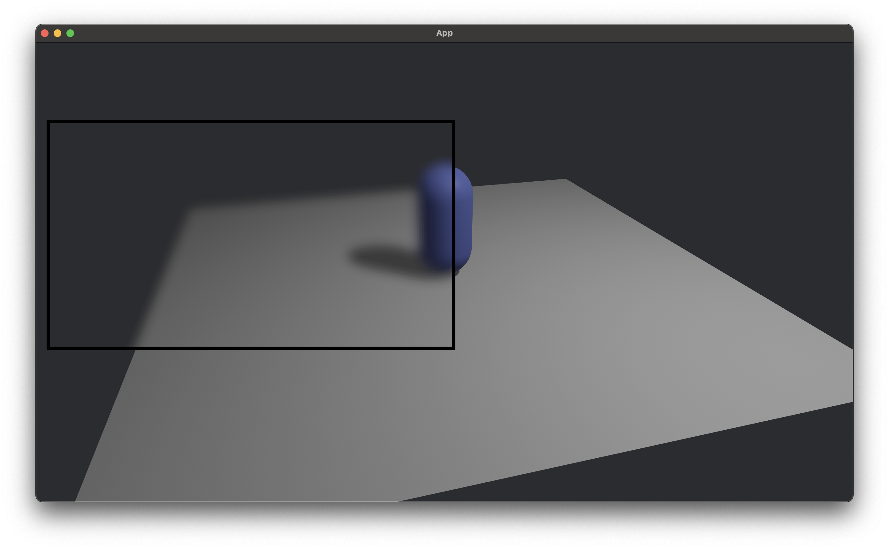

# Bevy Blur Regions

[](https://crates.io/crates/bevy_blur_regions)

A [Bevy](https://github.com/bevyengine/bevy) plugin to selectively blur regions of the screen.



## Usage

Add the plugin:

```rust
use bevy::prelude::*;
use bevy_blur_regions::prelude::*;

fn main() {
    App::new()
        .add_plugins(DefaultPlugins)
        .add_plugins(BlurRegionsPlugin::default())
        .run();
}
```

Add the `BlurRegionsCamera` component to the 3D camera whose output should be blurred:

```rust
commands.spawn((
    BlurRegionsCamera::default(),
    Camera3dBundle::default(),
));
```

When using Bevy UI, add the `BlurRegion` marker component to any Bevy UI nodes which should have a blurry background:

```rust
commands.spawn((
    BlurRegion,
    NodeBundle {
        style: Style {
            width: Val::Percent(50.0),
            height: Val::Percent(50.0),
            left: Val::Percent(25.0),
            top: Val::Percent(25.0),
            ..default()
        },
        ..default()
    },
));
```

When using egui, enable the `egui` feature and then use the `show_with_blur` function instead of `show` when adding contents to an egui window:

```rust
fn draw_ui(
    mut contexts: EguiContexts,
    mut blur_region_cameras: Query<&mut bevy_blur_regions::DefaultBlurRegionsCamera>)
{
    let mut blur_regions = blur_region_cameras.single_mut();

    let frame = egui::Frame::window(&contexts.ctx_mut().style())
        .fill(egui::Color32::from_rgba_premultiplied(27, 27, 27, 100))
        .rounding(0.0)
        .shadow(egui::epaint::Shadow::NONE);

    egui::Window::new("Blurry Window")
        .frame(frame)
        .show_with_blur(&mut blur_regions, contexts.ctx_mut(), |ui| {
            ui.label("This window has a nice blurry background.")
        });
}
```

For other use cases, the immediate mode blurring api can be called each frame:

```rust
fn update(mut blur_region_cameras: Query<&mut BlurRegionsCamera>) {
    let Ok(mut blur_regions) = blur_region_cameras.get_single_mut() else {
        return;
    };
    blur_regions.blur(Rect::from_center_size(vec2(100.0, 100.0), vec2(200.0, 200.0)));
}
```

See the examples for working implementations of all of the above.

## Caveats

### The number of blur regions is limited

The number of blur regions that can be present on the screen at the same time is limited to 20.

## Compatibility

| bevy_blur_regions | bevy | bevy_egui |
|-------------------|------|-----------|
| 0.3.0             | 0.14 | 0.28      |
| 0.2.0             | 0.13 | 0.26      |
| 0.1.0             | 0.13 | N/A       |

## License

All code in this repository is dual-licensed under either:

    MIT License (LICENSE-MIT or http://opensource.org/licenses/MIT)
    Apache License, Version 2.0 (LICENSE-APACHE or http://www.apache.org/licenses/LICENSE-2.0)

at your option. This means you can select the license you prefer.
